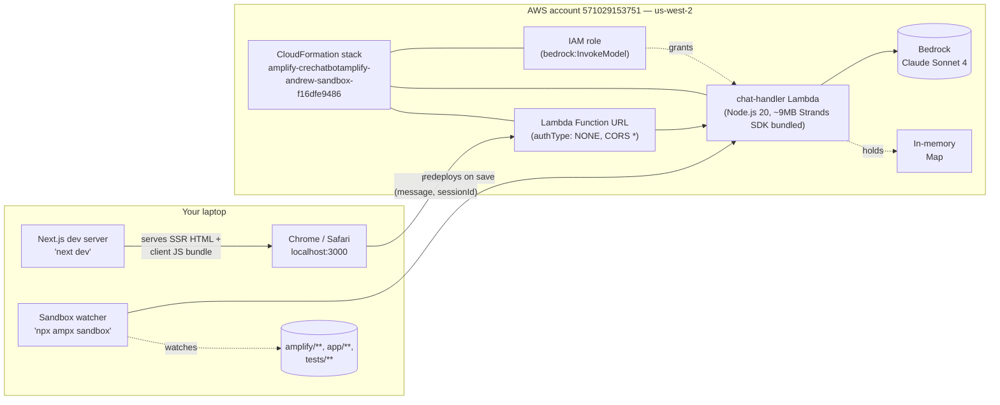
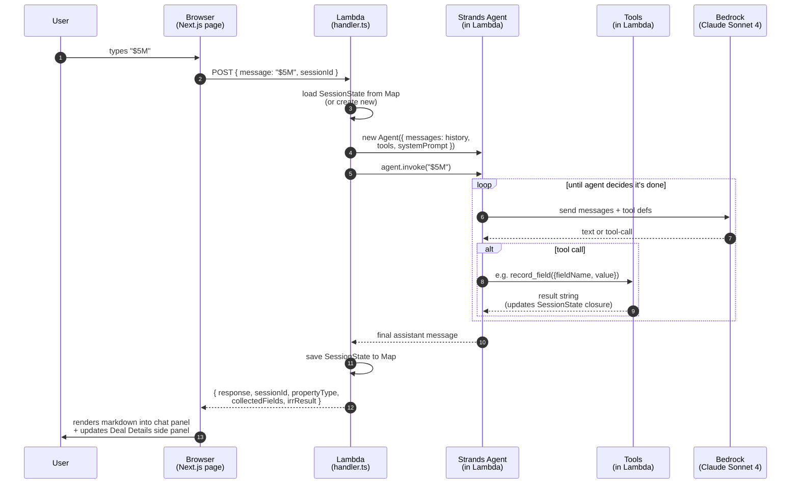

# Architecture — what runs where

Visual reference for the CRE chatbot stack: where each component runs, what
happens on a single chat turn, and the mental model for thinking about the
layers.

---

## 1. Where does each piece run

| Component | Location | Process / Service | Lifecycle |
|---|---|---|---|
| **Browser UI** | Your laptop, in Chrome/Safari | Tab pointed at `http://localhost:3000` | Per browser tab |
| **Next.js dev server** | Your laptop | `next dev` (Node process) | While `npm run dev` is running |
| **Sandbox watcher** | Your laptop | `npx ampx sandbox` (Node process) | While the watcher is running; auto-redeploys on `amplify/**` save |
| **CloudFormation stack** | AWS, `us-west-2`, account `571029153751` | `amplify-crechatbotamplify-andrew-sandbox-f16dfe9486` | Until you `npx ampx sandbox delete` |
| **Chat Lambda** | Inside that stack | `chat-handler-lambda` (Node.js 20) | Cold-starts on demand; warm container lives ~5 min idle |
| **Function URL** | Inside that stack | `https://mixz6...lambda-url.us-west-2.on.aws/` | Lifetime of the Lambda |
| **IAM role** | Inside that stack | Lambda execution role with `bedrock:InvokeModel` | Lifetime of the Lambda |
| **Bedrock** | AWS-managed, regional | Claude Sonnet 4 model access in `us-west-2` | Always-on AWS service; you opted in once via Bedrock Console |
| **Session state** | Inside the warm Lambda container | `Map<sessionId, SessionState>` in process memory | Lost on cold start or container cycle |
| **Historical handoff doc** | Your laptop only, in `docs/archive/handoff-2026-05-10.md` | Static markdown | Preserved for context; describes the pre-pivot LangGraph.js plan, not the current shape |

### Picture



---

## 2. What happens on a single chat turn



Key things to notice in this picture:
- **The agent loop is entirely inside the Lambda.** Multiple Bedrock calls + tool invocations all happen within one `agent.invoke()` call, which is one HTTP request from the browser.
- **Tools are pure JS functions.** `set_property_type`, `record_field`, `calculate_irr`, `run_sensitivity` — they execute in the Lambda's Node process, mutating the per-session closure. No network calls, no external DB.
- **Bedrock is the only external service hit per turn.** The IRR math is local; no API calls leave the Lambda except to Bedrock.
- **State only lives in one place:** the in-memory `Map` in the Lambda. Cold start = wiped.

---

## 3. Mental model

Four layers, top to bottom:

```
┌──────────────────────────────────────────────────────────┐
│  Layer 1 — UI                                            │
│  Next.js page, ChatComponent, useChatbot hook            │
│  Concern: render conversation, capture user input        │
│  Where: laptop today; eventually Amplify Hosting / Vercel │
└──────────────────────────────────────────────────────────┘
                          │ HTTP POST per turn
                          ▼
┌──────────────────────────────────────────────────────────┐
│  Layer 2 — Agent runtime                                 │
│  Receives a message + session, runs the Strands loop,    │
│  returns final assistant message + structured state      │
│  Concern: orchestration, session storage, observability  │
│  Where: Lambda + Function URL                            │
└──────────────────────────────────────────────────────────┘
                          │ Bedrock InvokeModel + tool calls
                          ▼
┌──────────────────────────────────────────────────────────┐
│  Layer 3 — Strands Agent + tools + math                  │
│  System prompt, 4 tools, IRR + sensitivity math, Zod     │
│  validation                                              │
│  Concern: domain logic                                   │
│  Where: bundled into Layer 2's process. Pure code,       │
│  trivially testable independent of any runtime.          │
└──────────────────────────────────────────────────────────┘
                          │ model + tool calls
                          ▼
┌──────────────────────────────────────────────────────────┐
│  Layer 4 — Bedrock (AWS-managed)                         │
│  Claude Sonnet 4 model access in us-west-2.              │
└──────────────────────────────────────────────────────────┘
```

The boundary between Layers 2 and 3 is the load-bearing one. The Strands
agent + tools + math (Layer 3) are pure code that runs in any Node process
— so the Layer 2 runtime is replaceable without touching domain logic.
